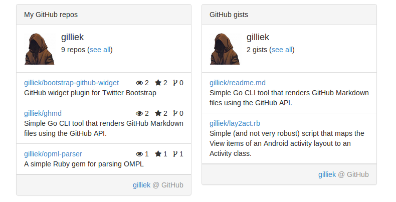

## Bootstrap Github Widget



### Demo

Take a look at the examples: `examples/index.html`

### Dependencies

* [jQuery 1.9.x](http://jquery.com/)
* [Twitter Bootstrap 3.x](http://getbootstrap.com/)
* [Font-Awesome 4.x (optional)](http://fortawesome.github.io/Font-Awesome/)

### Usage

#### Via data attributes

To display the widget, set `data-toggle="github-widget"` on a container element like
a div, along with a `data-user="foo"`.

```html
<div data-toggle="github-widget" data-user="myGithubUsername"></div>
```

#### Via data JavaScript

```javascript
$('#mywidget').githubWidget(options)
```

#### Options

Options can be passed via data attributes of JavaScript. For data attributes, append
the option name to `data-` as in `data-user="foo"`.


| Name | type | default | description |
|------|------|---------|-------------|
| user | string | ''    | TODO |
| widget | string | 'repos' | TODO |
| title | string | 'auto' | TODO |
| body | string | '' | TODO |
| footer | string | '' | TODO |
| classes | array of strings | [ ] | TODO |
| extrainfo | boolean | false | TODO |
| limit | integer | 5 | TODO |

### License

Bootstrap Github Widget is licensed under a BSD 3-clauses. See [LICENSE](https://github.com/gilliek/bootstrap-github-widget/blob/master/LICENSE).
